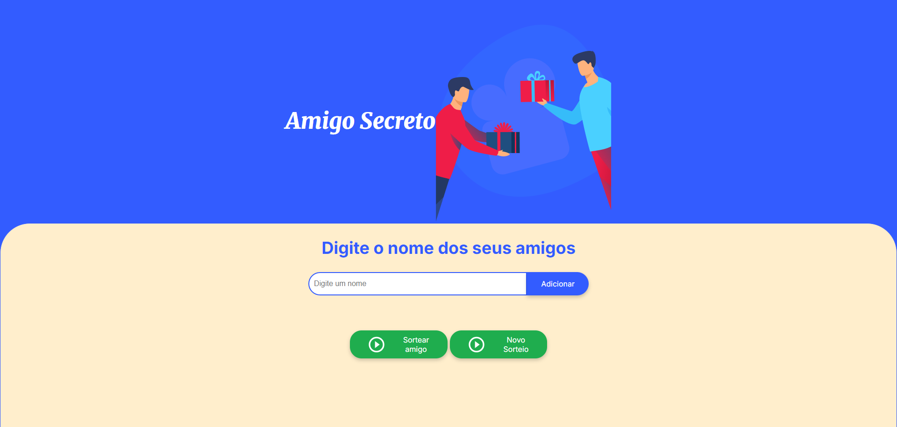

# Projeto/desafio: Amigo Secreto! 🎉

  
  
  

Este projeto foi desenvolvido como requisito obrigatório para a conclusão dos módulos "Formação a partir do zero: iniciante em programação" do curso **Alura - Oracle Next Education**. O objetivo é criar uma aplicação web onde os usuários possam adicionar nomes à lista de "amigos" e, em seguida, realizar o sorteio de um amigo secreto.

## 📝 Critérios exigidos:

- **Capturar o valor do campo de entrada:** Utilizando `document.getElementById` ou `document.querySelector` para obter o texto inserido pelo usuário.
- **Validar a entrada:** O campo não pode estar vazio, caso contrário, um alerta será exibido: "Por favor, insira um nome."
- **Atualizar o array de amigos:** Se o valor for válido, o nome será adicionado ao array com o método `.push()`.
- **Limpar o campo de entrada:** Após adicionar um nome, o campo de texto será resetado.
- **Função de sorteio:** Seleção aleatória de um dos nomes utilizando `Math.random()` e `Math.floor()`.
- **Mostrar o resultado:** Atualização do conteúdo de um elemento de resultado usando `innerHTML` para exibir o amigo sorteado.

## 🌟 Funcionalidades:

- **Adicionar nomes:** Os usuários podem adicionar nomes à lista visível ao clicar no botão "Adicionar".
- **Validação de entrada:** Se o campo de texto estiver vazio, um alerta será exibido solicitando o preenchimento do campo.
- **Evitar duplicidade de nomes:** Caso o nome seja repetido, um alerta informará que o nome já foi adicionado.
- **Visualização dos nomes:** A lista de nomes será exibida logo abaixo do campo de entrada.
- **Sorteio aleatório:** O nome sorteado será exibido ao clicar em "Sortear amigo".
- **Reiniciar o sorteio:** Todos os campos são limpos, permitindo um novo sorteio.

## 🔗 Link do projeto

Acesse o projeto através do [link aqui](https://amigo-secreto-ashy-six.vercel.app/). 

## 🎥 Como usar a aplicação:

1. Acesse o link do projeto/desafio para ser direcionado ao domínio.
2. Clique em "Digite um Nome".
3. Digite os nomes das pessoas participantes.
4. Digite cada nome no campo de entrada "Digite o nome do seu amigo" e clique em "Adicionar".
5. Quando terminar de adicionar, clique em "Sortear amigo" para ver o resultado do sorteio.
6. Caso o campo de nome esteja vazio e o botão "Adicionar" seja clicado, um alerta será exibido solicitando que você insira um nome.
7. Se tentar sortear com menos de três nomes na lista, um alerta informará que é necessário adicionar mais nomes.
8. Após o sorteio, clique em "Reiniciar o sorteio" para começar novamente.

## 💻 Autor

| [ Matheus Souza](https://github.com/ingridfreitas) |
| :---: |
